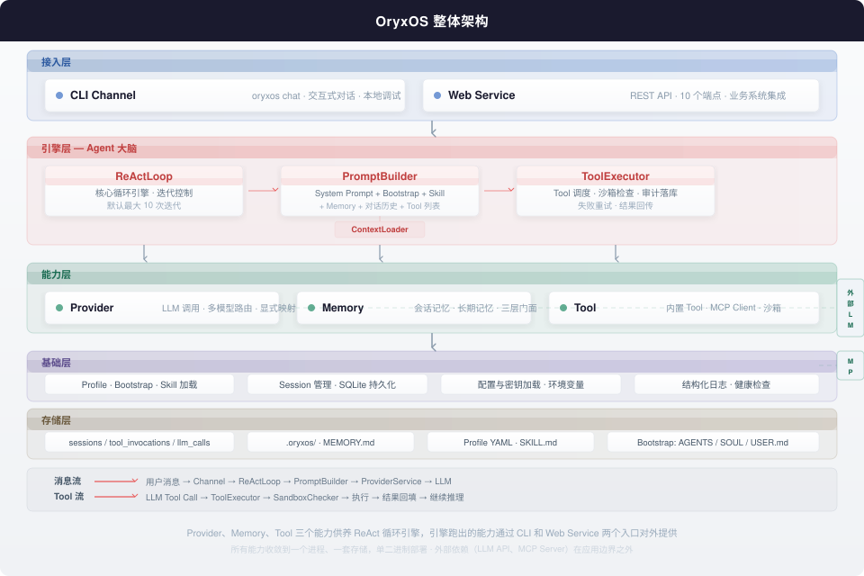

<p align="center">
  
</p>

<h1 align="center">OryxOS</h1>

<p align="center">
  <strong>装在企业自己的 K8s 或服务器上，作为统一底座跑各种业务 Agent</strong>
</p>

<p align="center">
  
  
  
</p>

---

## 这是什么

OryxOS 是一个**基于 Java 实现的面向企业场景的 Agent OS（智能体操作系统）**。它装在企业自己的 K8s 或服务器上，作为统一底座，在底座上跑各种业务 Agent——运维助手、客服助手、HR 助手、销售助手、知识管理助手——共享一套渠道接入、模型路由、工具调用、记忆系统、沙箱执行能力。**数据完全留在企业自己的基础设施，不锁任何云生态。**

业界已经有开源 Agent 项目把这套设计验证过（OpenClaw 用 Node.js，Hermes Agent 用 Python），但 Java 生态没有任何项目把 "Agent OS" 作为定位。Java 是大量企业现有后端的事实标准，Spring AI Alibaba 已经把底层 LLM 调用解决了，缺的就是上面那一层 "Agent OS"——OryxOS 填这个位置。

## 它解决了什么问题

今天企业落地 AI Agent 的瓶颈不在模型能力，而在工程底座。单个 Agent 做出 demo 很容易，但一旦要跑在生产环境、服务全公司，就撞上一堆问题：数据往哪放、怎么跟现有系统对接、怎么审计、怎么管权限。

OryxOS 解决的就是这层问题。**它把渠道接入、模型路由、记忆、工具、沙箱这些公共能力下沉到底座，业务方之上只需要配 Agent、写 Tool，上一个新 Agent 不用重复造这些轮子。**

对于严监管行业（金融、政务、电信、能源、医疗），这件事更刚性——核心业务的数据不能出企业，系统必须完全可审计，新组件要过现有的安全和合规流程，技术栈要跟现有 Java 体系对齐。OryxOS 就是为这个场景设计的。

## 跟其他项目的关系

| 项目 | 定位 | 语言 | 跟 OryxOS 的关系 |
|------|------|------|-----------------|
| OpenClaw | 个人/小团队 Agent OS | Node.js | 同类不同定位，通过 SKILL.md 互通 |
| Hermes Agent | 个人/小团队 Agent OS | Python | 同类不同定位，通过 SKILL.md 互通 |
| Dify、Coze | 可视化工作流编排平台 | Python/TS | 互补，可跑在 OryxOS 之上，拿它当后端 |
| Spring AI、LangChain4j | LLM 调用框架 | Java | 被 OryxOS 复用，做底层 LLM 调用 |
| OryxOS | 企业级 Agent OS 底座 | **Java** | — |

OryxOS 既不跟编排平台抢上层，也不跟框架抢底层，而是守在中间这一层——**让 Agent 能常驻、可治理、可审计地跑起来的底座**。

## 核心能力

核心阶段交付五大核心能力，每个能力都是 OryxOS 运行时内核的一部分。

| 能力 | 一句话 | 可以做什么 |
|------|--------|-----------|
| **对接 LLM** | Provider 抽象层，Agent 不感知具体调的是哪家模型 | 同一 Agent 在不同任务用不同模型，接入本地 Ollama/vLLM 数据不出企业 |
| **ReAct 循环** | Agent 大脑，Reason + Act，自主决策何时调用工具 | 多步骤任务一次对话连续完成，出错时自动回滚重试 |
| **三层记忆** | 会话记忆 + 长期记忆 MEMORY.md + 情景记忆 | 跨对话记住用户偏好，换新对话不需要重新解释 |
| **Plugin Tool** | 内置 5 个 Tool，业务方三种方式扩展 | 接 ERP/CRM/CMDB，零代码写 SKILL.md 就能上线新场景 |
| **Web Service** | REST API 对外暴露所有能力，10 个端点 | 任何语言的业务系统通过 HTTP 接入，把 AI 能力嵌入已有产品 |

五个能力不是独立的——**Provider、Memory、Tool 三个能力供养 ReAct 循环这个引擎，引擎跑出的能力通过 CLI 和 Web Service 两个入口对外提供。**

## 架构



OryxOS 是一个 Spring Boot 单体应用，对外只有两个入口：CLI（本地交互调试）和 Web Service（业务系统集成）。两个入口的消息汇入同一个 ReAct 循环引擎，引擎调度 Provider、Memory、Tool 完成推理和执行。所有能力收敛到一个进程、一套存储，符合"单二进制、装好就跑"的定位。

## 技术栈

| 组件 | 选型 | 说明 |
|------|------|------|
| 语言 & JDK | Java 21+ | Virtual Thread 支撑高并发 |
| 应用框架 | Spring Boot 3.x | 企业后端事实标准 |
| LLM 调用 | Spring AI Alibaba | 只用协议转换和 schema 生成，禁用自动 tool 执行 |
| Agent 循环 | 自实现 ReAct Loop | 核心约数十行 Java，完全可控 |
| HTTP 服务 | Spring MVC | 同步阻塞 + Virtual Thread，单机撑几千并发 |
| 持久化 | SQLite + Spring Data JPA | 单二进制，零外部依赖 |
| 长期记忆 | MEMORY.md 文件 | 关键词检索，接口预留向量检索升级空间 |
| 命令行 | Picocli | 12 个子命令，不需要 Spring 的命令直接走文件操作 |
| 配置解析 | SnakeYAML | Profile YAML 解析 |
| 工具协议 | MCP（Model Context Protocol） | JSON-RPC，社区标准 |
| 日志 | Logback + SLF4J | 结构化 JSON 日志 |
| 指标 | Micrometer + Prometheus | 扩展阶段 |

## 工程结构

```
oryxos/
├── oryxos-core/           核心引擎：ReActLoop、PromptBuilder、ToolExecutor、OryxTool 接口
├── oryxos-provider/       能力一：ProviderService，provider name 显式映射
├── oryxos-memory/         能力三：MemoryService 三层门面，LongTermMemory，MemoryTools
├── oryxos-tool/           能力四：内置 Tool + MCP Client + ToolRegistry + SandboxChecker
├── oryxos-web/            能力五：WebServer + 6 个 ApiController + 10 个端点
├── oryxos-channel-cli/    CLI Channel 交互式对话
├── oryxos-storage/        SQLite 存储层（sessions / tool_invocations / llm_calls）
├── oryxos-cli/            Picocli 命令行入口（12 个子命令）
└── oryxos-boot/           Spring Boot 启动模块，打包 fat JAR
```

9 个 Maven 模块，模块之间通过接口解耦。加新 Channel 或新 Tool 只加新模块不改 core。

## 快速开始

> 当前处于核心阶段开发中，以下为预期使用方式。

### 环境要求

- JDK 21+
- Maven 3.8+

### 三步跑起来

```bash
# 1. 克隆并编译
git clone https://github.com/oryxos/oryxos.git && cd oryxos
mvn clean package -DskipTests

# 2. 初始化工作区，配置 API Key
java -jar oryxos-boot/target/oryxos.jar init
export DEEPSEEK_API_KEY=sk-your-key

# 3. 开始对话
java -jar oryxos-boot/target/oryxos.jar chat
```

### 第一个对话

```
> 查一下北京今天的天气，告诉我穿什么合适

Agent 调用 HTTP Tool 获取天气数据，根据温度和天气状况给出穿衣建议。
整个过程在 ReAct 循环中自动完成——LLM 推理、Tool 调用、结果回填、继续推理。
```

### 启动 HTTP API 服务

```bash
java -jar oryxos-boot/target/oryxos.jar serve

# 另一个终端
curl -X POST http://localhost:8080/api/v1/sessions \
  -H "Content-Type: application/json" \
  -d '{"profileName": "default"}'

curl -X POST http://localhost:8080/api/v1/sessions/{id}/messages \
  -H "Content-Type: application/json" \
  -d '{"content": "帮我分析一下最近一周的服务器日志"}'
```

## 路线图

### 核心阶段（4 周，每周 3 小时）

| 周次 | 核心能力 | 可演示成果 |
|------|----------|-----------|
| 第一周 | LLM + ReAct 循环 | Agent 多轮对话，调 HTTP Tool 完成简单任务 |
| 第二周 | Memory + Tool 体系 | Agent 记住偏好，调用文件读写和外部 MCP 工具 |
| 第三周 | Web Service | 10 个 REST 端点完整调用链路 |
| 第四周 | 多 Agent + 收尾 | 多 Agent 并存，Session 跨重启恢复，主页可访问 |

核心阶段结束后，OryxOS 1.0 是一个可演示的最小完整 Agent OS 运行时内核。

### 扩展阶段

多 Channel 接入（企业微信、飞书、钉钉、Slack）、Memory 语义检索、情景记忆、Skill 体系、MCP Server 暴露、Tool Policy、完整 Sandbox 隔离、SSE 流式响应、认证与权限、Web 仪表板、SSO 多租户、完整审计、集群高可用。

### 社区共建

Skills Marketplace、多语言 SDK、可视化 Profile 编辑器、Kubernetes Operator、移动端管理台、Voice Channel、RISC-V 和边缘部署。

## 贡献

OryxOS 核心阶段由项目方主导开发，扩展阶段和社区共建功能以开源社区方式推进。欢迎各种形式的贡献：

- 报告 Bug 和改进建议
- 完善文档
- 贡献 Plugin Tool 和 MCP Server 适配
- 认领扩展功能和社区共建功能

详细的贡献指南（CONTRIBUTING.md）将在核心阶段完成后发布。

## 许可证

[Apache License 2.0](LICENSE)

## 了解更多

- [业界调研](docs/IndustryResearch.md) — 为什么 Java 生态需要 Agent OS，业界现状和空白
- [需求文档](docs/DemandAnalysis.md) — 功能需求和非功能需求，回答 What
- [技术方案](docs/TechnicalSolution.md) — 架构设计、模块划分、关键技术决策，回答 How
- [AI 编程指引](docs/AiProgrammingGuide.md) — Spec-Kit + Claude Code 实施方法，回答 How to build